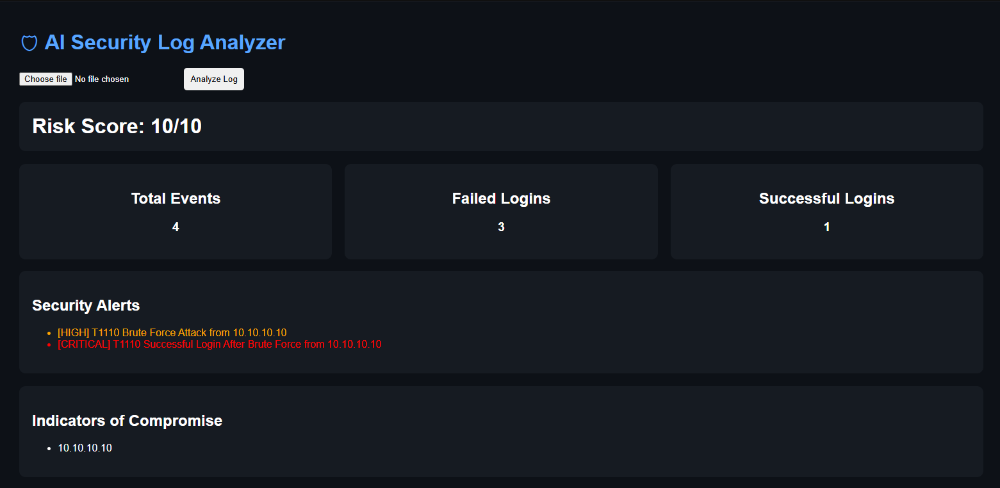

# Security Log Analyzer

A Python and Flask web application that analyzes authentication logs and detects brute-force login activity.

The application parses log files, identifies suspicious authentication patterns, extracts Indicators of Compromise (IOCs), and displays results through a web-based dashboard.

## Features

* Upload and analyze log files
* Brute-force attack detection
* Successful login after brute-force detection
* MITRE ATT&CK mapping (T1110)
* IOC extraction
* Risk score calculation
* Security dashboard
* Incident report generation

## Dashboard

## How It Works

1. Upload a log file
2. Parse authentication events
3. Apply detection rules
4. Extract IOCs
5. Calculate risk score
6. Display results in dashboard

## Example Detection

### Sample Log

Failed password for root from 10.10.10.10

Failed password for root from 10.10.10.10

Failed password for root from 10.10.10.10

Accepted password for root from 10.10.10.10

### Result

[HIGH] T1110 Brute Force Attack from 10.10.10.10

[CRITICAL] T1110 Successful Login After Brute Force from 10.10.10.10

Risk Score: 10/10

## Project Structure

ai-log-analyzer/

├── app.py

├── parser.py

├── detector.py

├── ioc.py

├── report.py

├── templates/

│ └── index.html

├── requirements.txt

└── README.md

## Technologies Used

* Python
* Flask
* HTML
* CSS
* Git
* GitHub

## Future Improvements

* SQLite alert history
* Additional detection rules
* Threat intelligence integration
* Interactive charts
* Docker deployment

## Author

Vishal Kataria

GitHub: github.com/vishalkataria077
