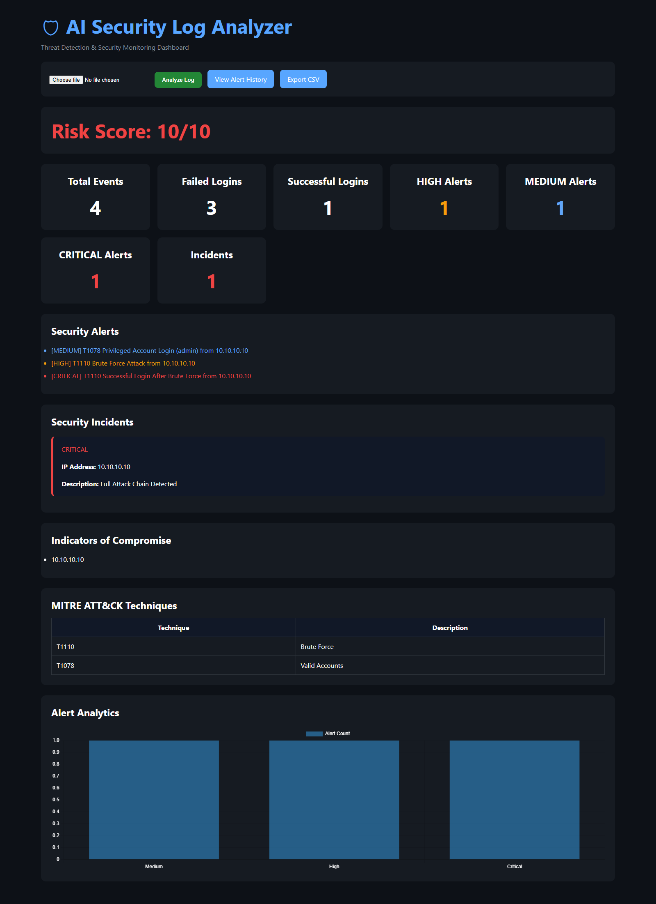
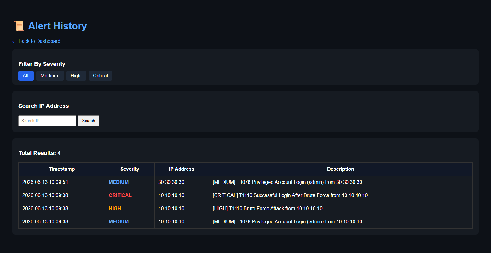

AI Security Log Analyzer

A SOC-style Security Information and Event Monitoring (SIEM) dashboard built with Python, Flask, and SQLite.

The application analyzes authentication logs, detects suspicious login activity, maps detections to MITRE ATT&CK techniques, correlates attack events into security incidents, stores alerts in a database, and provides security analysts with an interactive monitoring dashboard.

Features
Detection Rules
Brute Force Detection (MITRE ATT&CK T1110)
Successful Login After Brute Force Detection
Password Spraying Detection
Privileged Account Login Detection (MITRE ATT&CK T1078)
Security Monitoring
Security Dashboard
Risk Score Calculation
IOC (Indicator of Compromise) Extraction
MITRE ATT&CK Technique Mapping
Alert Analytics Charts
Security Incident Correlation
Attack Chain Detection
Incident Correlation (v1.6)
Incident Correlation Engine
Full Attack Chain Detection
Critical Incident Identification
Incident Counter Dashboard
Security Incident Panel
Alert Management
SQLite Alert Storage
Alert History Dashboard
Severity-Based Filtering
IP Address Search
CSV Export Functionality

---

## Dashboard

### Main Security Dashboard

### Alert History

---

Detection Examples

Brute Force Attack (T1110)

Sample Log
Failed password for root from 10.10.10.10
Failed password for root from 10.10.10.10
Failed password for root from 10.10.10.10
Detection
[HIGH] T1110 Brute Force Attack from 10.10.10.10

Successful Login After Brute Force

Sample Log
Failed password for root from 10.10.10.10
Failed password for root from 10.10.10.10
Failed password for root from 10.10.10.10
Accepted password for root from 10.10.10.10

Detection
[HIGH] T1110 Brute Force Attack from 10.10.10.10
[CRITICAL] T1110 Successful Login After Brute Force from 10.10.10.10

Password Spraying Attack

Sample Log
Failed password for admin from 20.20.20.20
Failed password for john from 20.20.20.20
Failed password for david from 20.20.20.20
Detection
[HIGH] Password Spraying Attack from 20.20.20.20

Privileged Account Login (T1078)

Sample Log
Accepted password for admin from 10.10.10.10
Detection
[MEDIUM] T1078 Privileged Account Login (admin) from 10.10.10.10

Full Attack Chain Detection (v1.6)

Sample Log
Failed password for admin from 10.10.10.10
Failed password for admin from 10.10.10.10
Failed password for admin from 10.10.10.10
Accepted password for admin from 10.10.10.10

Detection -
[HIGH] T1110 Brute Force Attack from 10.10.10.10
[CRITICAL] T1110 Successful Login After Brute Force from 10.10.10.10
[MEDIUM] T1078 Privileged Account Login (admin) from 10.10.10.10

Generated Incident
CRITICAL

Full Attack Chain Detected

IP Address: 10.10.10.10

MITRE ATT&CK Mapping
Technique	Description
T1110	    Brute Force
T1078	    Valid Accounts

Project Structure
Security-LogAnalyzer/
│
├── app.py
├── parser.py
├── detector.py
├── correlation.py
├── ioc.py
├── database.py
├── alerts.db
│
├── templates/
│   ├── index.html
│   └── history.html
│
├── screenshots/
│   ├── dashboard-v1.6.png
│   ├── incidents-v1.6.png
│   └── history-v1.6.png
│
├── requirements.txt
└── README.md

Technologies Used
Python
Flask
SQLite
HTML
CSS
Chart.js
Git
GitHub
MITRE ATT&CK Framework
Current Release
v1.6

Features Added:

Incident Correlation Engine
Full Attack Chain Detection
Security Incident Dashboard
Incident Counter
Improved Risk Score Visualization
Enhanced Dashboard UI
Better Alert Presentation
Future Improvements
Attack Timeline
GeoIP Enrichment
Threat Intelligence Integration
Security Recommendations
User Authentication
Docker Deployment
REST API Support
Author

Vishal Kataria

GitHub: https://github.com/vishalkataria077

