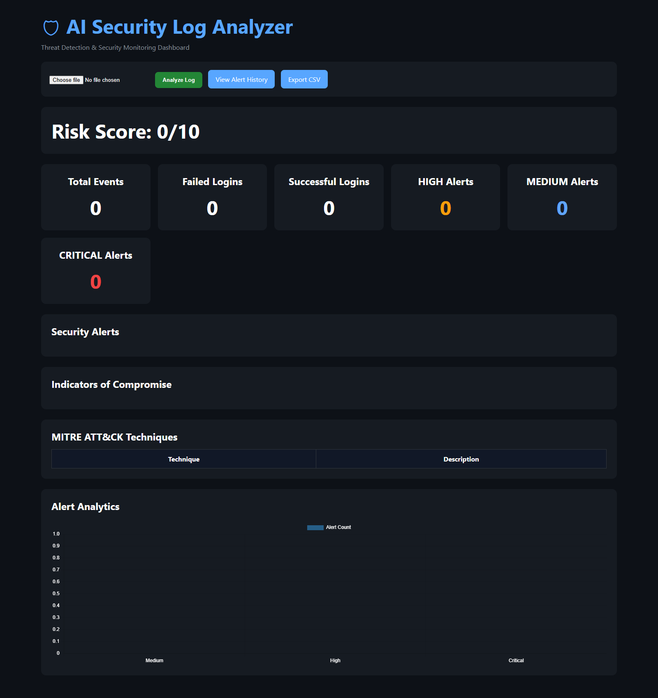

# AI Security Log Analyzer

A SOC-style Security Information and Event Monitoring (SIEM) dashboard built with Python, Flask, and SQLite.

The application analyzes authentication logs, detects suspicious login activity, maps detections to MITRE ATT&CK techniques, stores alerts in a database, and provides security analysts with an interactive monitoring dashboard.

---

## Features

### Detection Rules

* Brute Force Detection (MITRE ATT&CK T1110)
* Successful Login After Brute Force Detection
* Password Spraying Detection
* Privileged Account Login Detection (MITRE ATT&CK T1078)

### Security Monitoring

* Security Dashboard
* Risk Score Calculation
* IOC (Indicator of Compromise) Extraction
* MITRE ATT&CK Technique Mapping
* Alert Analytics Charts

### Alert Management

* SQLite Alert Storage
* Alert History Dashboard
* Severity-Based Filtering
* IP Address Search
* CSV Export Functionality

---

## Dashboard

### Main Security Dashboard



### Alert History


---

## Detection Examples

### Brute Force Attack (T1110)

#### Sample Log

```text
Failed password for root from 10.10.10.10
Failed password for root from 10.10.10.10
Failed password for root from 10.10.10.10
```

#### Detection

```text
[HIGH] T1110 Brute Force Attack from 10.10.10.10
```

---

### Successful Login After Brute Force

#### Sample Log

```text
Failed password for root from 10.10.10.10
Failed password for root from 10.10.10.10
Failed password for root from 10.10.10.10
Accepted password for root from 10.10.10.10
```

#### Detection

```text
[HIGH] T1110 Brute Force Attack from 10.10.10.10
[CRITICAL] T1110 Successful Login After Brute Force from 10.10.10.10
```

---

### Password Spraying Attack

#### Sample Log

```text
Failed password for admin from 20.20.20.20
Failed password for john from 20.20.20.20
Failed password for david from 20.20.20.20
```

#### Detection

```text
[HIGH] Password Spraying Attack from 20.20.20.20
```

---

### Privileged Account Login (T1078)

#### Sample Log

```text
Accepted password for admin from 30.30.30.30
```

#### Detection

```text
[MEDIUM] T1078 Privileged Account Login (admin) from 30.30.30.30
```

---

## MITRE ATT&CK Mapping

| Technique | Description    |
| --------- | -------------- |
| T1110     | Brute Force    |
| T1078     | Valid Accounts |

---

## Project Structure

```text
ai-log-analyzer/
│
├── app.py
├── parser.py
├── detector.py
├── ioc.py
├── database.py
├── alerts.db
│
├── templates/
│   ├── index.html
│   └── history.html
│
├── screenshots/
│   ├── dashboard-v1.6.png
│   └── alert-history-v1.6.png
│
├── requirements.txt
└── README.md
```

---

## Technologies Used

* Python
* Flask
* SQLite
* HTML
* CSS
* Chart.js
* Git
* GitHub
* MITRE ATT&CK Framework

---

## Current Release

### v1.6

Features Added:

* Alert Analytics Dashboard
* SQLite Alert History
* CSV Export
* Severity Filtering
* IP Address Search
* MITRE ATT&CK Mapping
* Password Spraying Detection
* Privileged Account Login Detection

---

## Future Improvements

* GeoIP Enrichment
* Threat Intelligence Integration
* Alert Correlation Rules
* User Authentication
* Docker Deployment
* REST API Support

---

## Author

**Vishal Kataria**

GitHub: https://github.com/vishalkataria077

